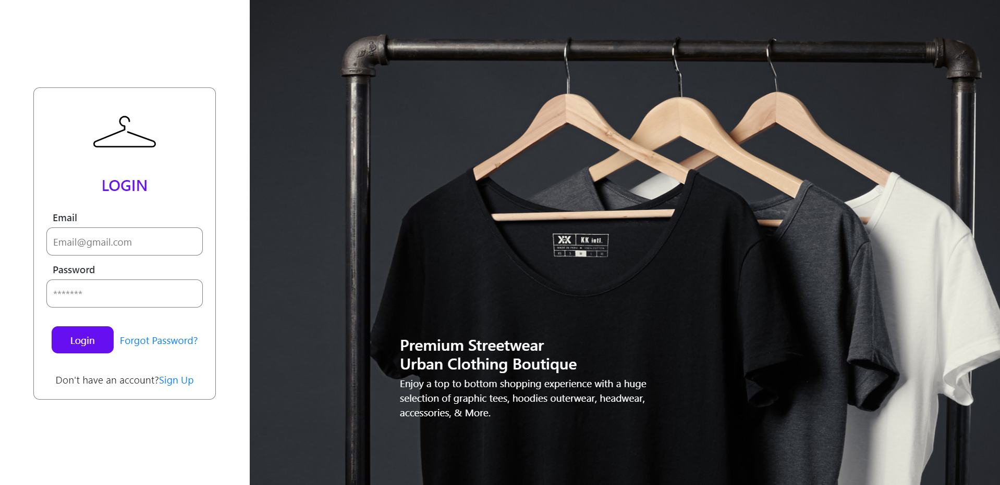
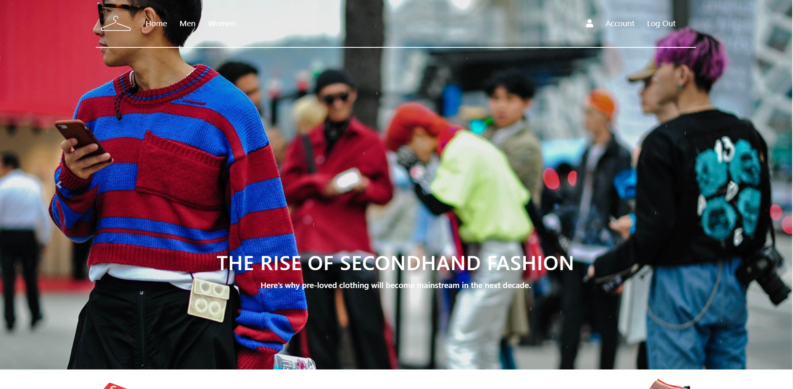
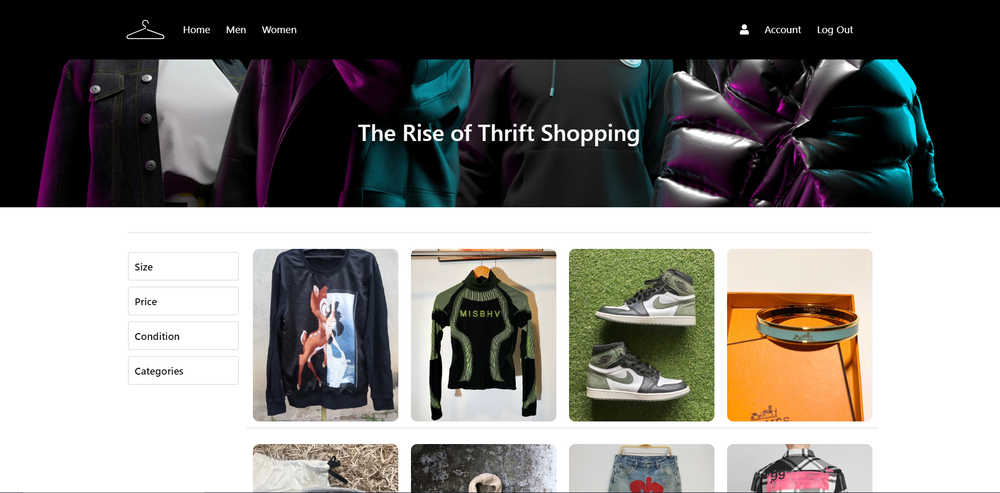

# thrift-shop

I create a Furniture store website - Using React js, Axios, Redux, Nodejs Express server, Db mongoDB mongoose.


## Preview





## How to use

1. Clone/Download the repo.
2. Run this in the client folder and server folder.
```
Run npm install.
```
